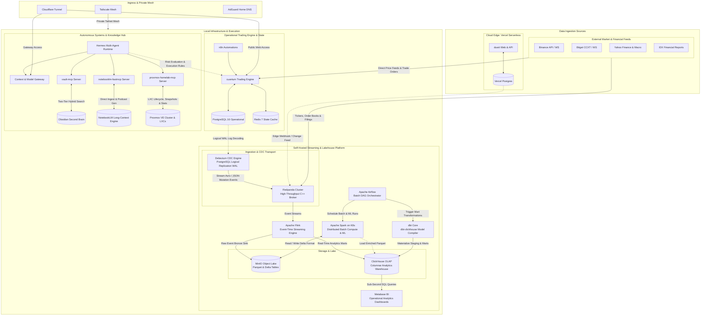

# Muhammad Pandu Dwi Cahyo

<p align="left">
  <a href="https://linkedin.com/in/mpandudc"></a>
  <a href="https://mpandudc.com"></a>
  <a href="mailto:mpandudc%40gmail.com"></a>
</p>

Data Engineer Supervisor focused on high-throughput streaming pipelines (10K+ RPS) and distributed analytical platforms in fintech/crypto (CFX, Pintu). Experienced in production Flink, Spark on K8s, Airflow orchestration, and Snowflake/AWS infrastructure.

MBA Candidate in Business Leadership Executive at SBM ITB. B.Eng. in Computer Engineering from Universitas Brawijaya (Cum Laude, 3.93/4.00).

---

### Personal Homeserver & Distributed Systems Architecture



---

### Systems & Projects

#### Streaming & Lakehouse
* **Self-Hosted Data Platform** — 100% on-premise, containerized lakehouse and columnar analytics engine:
  * **Event Streaming & Ingestion**: **Debezium CDC Engine** (capturing PostgreSQL logical WAL mutation logs without query overhead) and **Redpanda** (low-latency C++ event broker ingesting CDC streams, Vercel edge syncs, and multi-venue market feeds: Binance, Bitget, Yahoo Finance, and IDX), orchestrated by **Apache Airflow**.
  * **Stream Processing**: **Apache Flink** (stateful event-time surveillance, rolling window aggregations, and sub-second sinks into ClickHouse and MinIO).
  * **Storage & Batch Lakehouse**: **MinIO** (S3-compatible local lakehouse) and **Apache Spark on K8s** (distributed feature transformations and Delta Lake table ACID format).
  * **OLAP Analytics & dbt Modeling**: **ClickHouse** (high-concurrency columnar analytics warehouse) transformed via **dbt Core** (`dbt-clickhouse` adapter) for automated staging, intermediate metrics, and dimensional data marts.
  * **BI & Serving**: **Metabase** (sub-second SQL dashboards for trading performance and operational metrics).
* **[flink-market-surveillance](https://github.com/mpandudc/flink-market-surveillance)** — Event-time market surveillance, wash-trading pattern detection, and deterministic replay harness built with Apache Flink and Kafka.
* **[spark-delta-lakehouse](https://github.com/mpandudc/spark-delta-lakehouse)** — Spark Structured Streaming with Delta Lakehouse Medallion architecture and ACID transactions.
* **[streaming-ml-features](https://github.com/mpandudc/streaming-ml-features)** — Streaming ML feature store parity engine ensuring zero-drift between online and offline feature generation.
* **[flink-vs-spark-benchmark](https://github.com/mpandudc/flink-vs-spark-benchmark)** — Benchmark comparing throughput, backpressure handling, and event-time latency between Apache Flink and Spark Structured Streaming.

#### AI Systems & Agent Tooling
* **[proxmox-homelab-mcp](https://github.com/mpandudc/proxmox-homelab-mcp)** — FastMCP server for Proxmox VE & Homelab cluster ops. Direct LXC container lifecycle (`start`/`stop`/`reboot`), point-in-time snapshots, service health inspection, and Tailscale mesh status.
* **[notebooklm-fastmcp](https://github.com/mpandudc/notebooklm-fastmcp)** — FastMCP server for Google NotebookLM. Direct-path ingestion (zero chat token consumption), Google Master Token auto-reminting, 1-shot audio deep dives, and Obsidian note generation.
* **[obsidian-hybrid-rag-mcp](https://github.com/mpandudc/obsidian-hybrid-rag-mcp)** — MCP server for Obsidian Second Brain. Two-Tier Hybrid RAG (FTS5 BM25 + dense BGE-M3 vector + Jina cross-encoder reranking) with in-memory caching.

#### Trading & Applications
* **[cuantum](https://github.com/mpandudc/cuantum)** *(Private)* — Algorithmic multi-venue trading and market analytics engine:
  * **Exchange Execution**: Native spot & perpetual futures execution via **Binance** and **Bitget** (CCXT async integration with automated bracket orders and dynamic position sizing).
  * **Market & Alternative Data Ingestion**: Real-time ticker and orderbook streaming into Redpanda/Flink, combined with macro, index, and equity financial history feeds from **Yahoo Finance** and **IDX (Indonesia Stock Exchange)** financial disclosure filings.
  * **State & Reliability**: FastAPI backend, PostgreSQL 16 (transactional ledger), and Redis 7 (in-memory pub/sub & candle caching).
* **[duwit](https://github.com/mpandudc/duwit)** — Financial tracking and analytics app built with Next.js and Drizzle ORM. Fully serverless stack deployed on **Vercel** (Frontend, Serverless Route Handlers, and Vercel Postgres) with automated transaction reconciliation pipelines.

---

### Tech Stack

```
Streaming & Big Data : Apache Flink, Apache Spark, Redpanda, Debezium CDC, Apache Airflow, Kafka, Delta Lake, dbt Core
Storage & Lakehouse  : ClickHouse, MinIO, PostgreSQL 16, DuckDB, TimescaleDB, Redis 7
Data Modeling        : dbt-clickhouse, Medallion Architecture, Dimensional Modeling (Star Schema)
Market & Feeds       : Binance WS/REST, Bitget CCXT, Yahoo Finance, IDX Financial Reports
BI & Serving         : Metabase, Grafana
Cloud & Infra        : AWS (EMR, S3, Glue, Lambda, Athena), Kubernetes, Docker, Vercel, Terraform
Languages            : Python, SQL, TypeScript, C/C++, Rust, Bash
Architecture         : CDC (Debezium/DMS), Streaming ML Parity, High-throughput (10K+ RPS)
```

---

### Education

* **MBA in Business Leadership Executive** — School of Business and Management, Institut Teknologi Bandung (SBM ITB)
* **B.Eng. in Computer Engineering** — Universitas Brawijaya *(Cum Laude, CGPA 3.93/4.00)*
