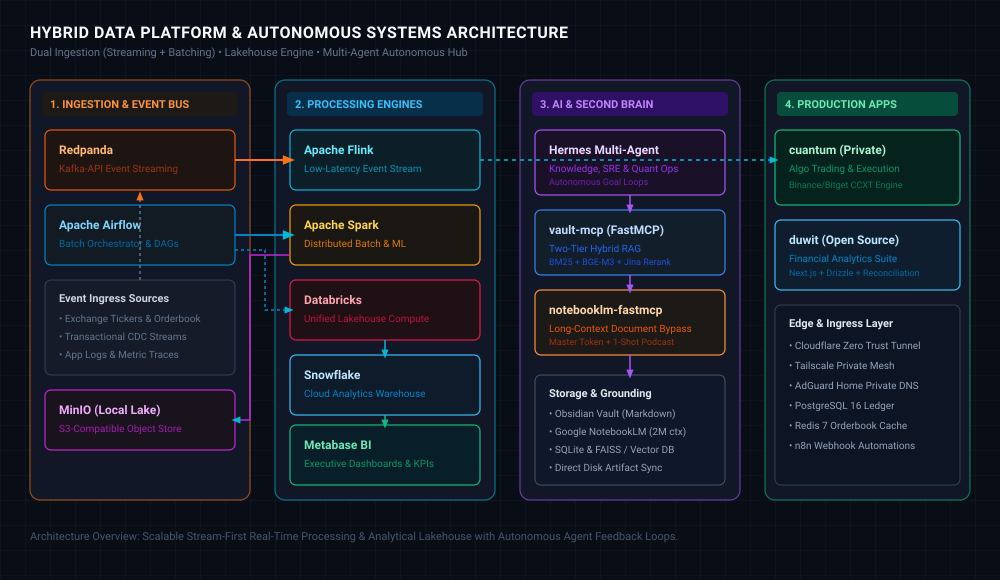

# Muhammad Pandu Dwi Cahyo

<p align="left">
  <a href="https://linkedin.com/in/mpandudc"></a>
  <a href="https://mpandudc.com"></a>
  <a href="mailto:mpandudc@gmail.com"></a>
</p>

**Data Engineer Supervisor** with 4+ years of experience architecting high-throughput, low-latency streaming pipelines (10K+ RPS) and distributed data platforms in fintech and cryptocurrency (CFX, Pintu). Proven record in leading engineering teams, executing Snowflake/AWS migrations (25% compute cost reduction), and orchestrating Apache Flink, Spark, and Airflow on Kubernetes.

Currently pursuing an **MBA in Business Leadership Executive at SBM ITB** to bridge large-scale distributed data systems with strategic business growth, regulatory compliance, and quantitative product execution.

---

### 🌐 Hybrid Data Platform & Systems Architecture

A distributed hybrid architecture pairing high-throughput event streaming, an analytical batch lakehouse, autonomous multi-agent execution, and personal knowledge retrieval:

<p align="center">
  
</p>

---

### 🚀 Systems & Projects

#### 📊 Real-Time Streaming & Analytical Lakehouse
* **Target Hybrid Data Platform** *(Streaming & Batching)*:
  * **Event Streaming & Ingestion**: **Redpanda** (Kafka-compatible, C++ engine for zero-JVM high-throughput event ingestion) & **Apache Airflow** (orchestrating scheduled extractions and batch ELT DAGs).
  * **Processing & Transformation**: **Apache Flink** (low-latency stateful stream processing, CEP market surveillance) & **Apache Spark / Databricks** (large-scale distributed batch compute, ML feature pipelines, Delta Lake ACID).
  * **Storage & Warehouse**: **MinIO** (local S3-compatible object lakehouse) & **Snowflake** (cloud analytics data warehouse).
  * **Business Intelligence & Serving**: **Metabase** (KPI metrics, quantitative reporting, risk dashboards).
* **[flink-market-surveillance](https://github.com/mpandudc/flink-market-surveillance)** — Event-time market surveillance, wash-trading pattern detection, and deterministic replay harness built on Apache Flink and Kafka.
* **[spark-delta-lakehouse](https://github.com/mpandudc/spark-delta-lakehouse)** — Replay-safe Spark Structured Streaming and Delta Lakehouse implementation using ACID transactions and Medallion architecture.
* **[streaming-ml-features](https://github.com/mpandudc/streaming-ml-features)** — Online and offline streaming ML feature store parity system ensuring zero-drift feature computation and backfill replay.
* **[flink-vs-spark-benchmark](https://github.com/mpandudc/flink-vs-spark-benchmark)** — Reproducible streaming benchmark comparing throughput, backpressure handling, and end-to-end event-time latency between Apache Flink and Spark Structured Streaming.

#### 🤖 AI Engineering & Autonomous Agents
* **[notebooklm-fastmcp](https://github.com/mpandudc/notebooklm-fastmcp)** — Lean FastMCP server for Google NotebookLM. Built for zero-token context offloading, Google Master Token (AAS) auto-reminting, 1-shot audio deep dives, and Obsidian sync.
* **[obsidian-hybrid-rag-mcp](https://github.com/mpandudc/obsidian-hybrid-rag-mcp)** — High-performance MCP server delivering Two-Tier Hybrid RAG (FTS5 BM25 + dense BGE-M3 1024-dim vector + Jina cross-encoder reranking) with sub-second retrieval over private Markdown knowledge bases.

#### 📈 Quantitative Trading & Financial Systems
* **[cuantum](https://github.com/mpandudc/cuantum)** *(Private)* — Self-hosted algorithmic crypto trading signal and order execution platform. Built on FastAPI, SQLAlchemy async, React/TypeScript, and CCXT. Features automated bracket execution and risk management across Binance and Bitget.
* **[duwit](https://github.com/mpandudc/duwit)** — Personal financial analytics engine and expense tracking suite built on Next.js, Drizzle ORM, and automated transaction reconciliation pipelines.

---

### 🛠️ Core Engineering Stack

```
Streaming & Big Data : Apache Flink, Apache Spark, Redpanda, Apache Airflow, Kafka, Delta Lake, dbt
Storage & Lakehouse  : Snowflake, Databricks, MinIO, PostgreSQL, DuckDB, TimescaleDB, Redis
BI & Serving         : Metabase, Grafana
Cloud & Distributed  : AWS (EMR, S3, Glue, Lambda, Athena), Kubernetes, Docker, Terraform
Languages            : Python, SQL, C/C++, Rust, Bash
Architecture         : Medallion Architecture, CDC (Debezium/DMS), Streaming ML Feature Parity, High-throughput (10K+ RPS)
```

---

### 🎓 Background & Education

* **Master of Business Administration (MBA)** — School of Business and Management, Institut Teknologi Bandung (SBM ITB) *(Business Leadership Executive)*
* **Bachelor of Engineering (B.Eng.) in Computer Engineering** — Universitas Brawijaya *(Cum Laude, CGPA 3.93/4.00)*
