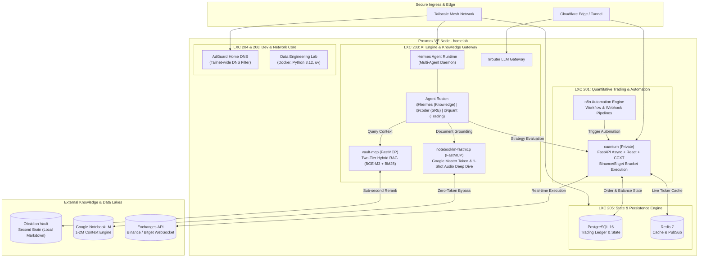

# Muhammad Pandu Dwi Cahyo

<p align="left">
  <a href="https://linkedin.com/in/mpandudc"></a>
  <a href="https://mpandudc.com"></a>
  <a href="mailto:mpandudc@gmail.com"></a>
</p>

**Data Engineer Supervisor** with 4+ years of experience architecting high-throughput, low-latency streaming pipelines (10K+ RPS) and distributed data platforms in fintech and cryptocurrency (CFX, Pintu). Proven record in leading engineering teams, executing Snowflake/AWS migrations (25% compute cost reduction), and orchestrating Apache Flink, Spark, and Airflow on Kubernetes.

Currently pursuing an **MBA in Business Leadership Executive at SBM ITB** to bridge large-scale distributed data systems with strategic business growth, regulatory compliance, and quantitative product execution.

---

### 🌐 Homelab & Autonomous Systems Topology

A high-availability, self-hosted homelab environment (Intel i5-8500T 6C / 32GB RAM Proxmox node) running a hybrid multi-agent AI framework, algorithmic trading execution engine, and second-brain retrieval pipelines:



---

### 🚀 Ecosystem & Featured Systems

#### 🤖 AI Engineering & Autonomous Agents
* **[notebooklm-fastmcp](https://github.com/mpandudc/notebooklm-fastmcp)** — Lean FastMCP server for Google NotebookLM. Engineered for zero-token context offloading, Google Master Token (AAS) auto-reminting, 1-shot audio podcast generation, and Obsidian sync.
* **[obsidian-hybrid-rag-mcp](https://github.com/mpandudc/obsidian-hybrid-rag-mcp)** — High-performance MCP server delivering Two-Tier Hybrid RAG (FTS5 BM25 + dense BGE-M3 1024-dim vector + Jina cross-encoder reranking) with sub-second retrieval over private Markdown knowledge bases.

#### 📈 Quantitative Trading & Financial Systems
* **[cuantum](https://github.com/mpandudc/cuantum)** *(Private)* — Self-hosted algorithmic crypto trading signal and order execution platform. Built on FastAPI, SQLAlchemy async, React/TypeScript, and CCXT. Features automated bracket execution and risk management across Binance and Bitget.
* **[duwit](https://github.com/mpandudc/duwit)** — Modern personal financial analytics engine and expense tracking suite built on Next.js, Drizzle ORM, and automated transaction reconciliation pipelines.

---

### 🛠️ Core Engineering Stack

```
Streaming & Big Data : Apache Flink, Apache Spark, Apache Airflow, Kafka, Apache Hudi, Iceberg
Data Warehouses      : Snowflake, BigQuery, PostgreSQL, TimescaleDB, Redis
Cloud & Distributed  : AWS (EMR, S3, Glue, Lambda, Athena), Kubernetes, Docker, Terraform
Languages            : Python, SQL, C/C++, Rust, Bash
Architecture         : Medallion Architecture, CDC (Debezium/DMS), High-throughput Ingestion (10K+ RPS)
```

---

### 🎓 Background & Education

* **Master of Business Administration (MBA)** — School of Business and Management, Institut Teknologi Bandung (SBM ITB) *(Business Leadership Executive)*
* **Bachelor of Engineering (B.Eng.) in Computer Engineering** — Universitas Brawijaya *(Cum Laude, CGPA 3.93/4.00)*

---

<p align="left">
  
  
</p>
