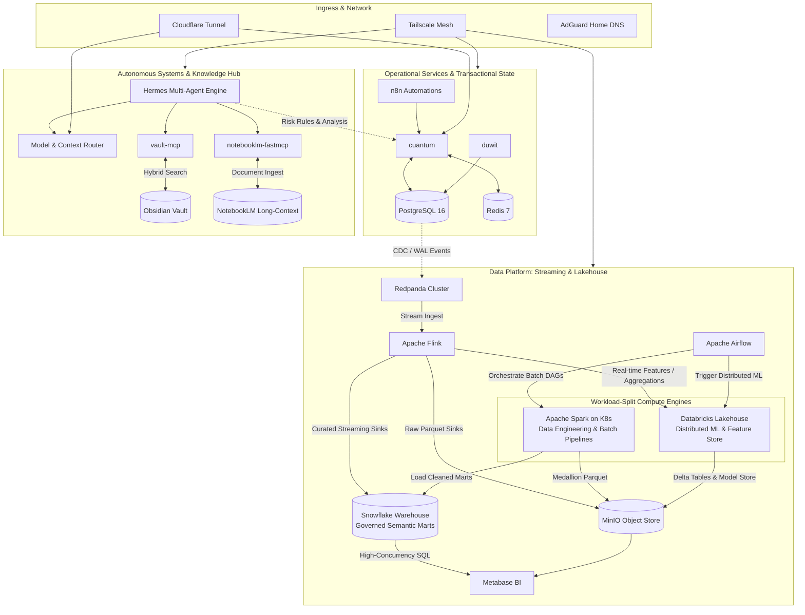

# Muhammad Pandu Dwi Cahyo

<p align="left">
  <a href="https://linkedin.com/in/mpandudc"></a>
  <a href="https://mpandudc.com"></a>
  <a href="mailto:mpandudc%40gmail.com"></a>
</p>

Data Engineer Supervisor focused on high-throughput streaming pipelines (10K+ RPS) and distributed analytical platforms in fintech/crypto (CFX, Pintu). Experienced in production Flink, Spark on K8s, Airflow orchestration, and Snowflake/AWS infrastructure.

MBA Candidate in Business Leadership Executive at SBM ITB. B.Eng. in Computer Engineering from Universitas Brawijaya (Cum Laude, 3.93/4.00).

---

### Personal Homeserver & Distributed Systems Architecture



---

### Systems & Projects

#### Streaming & Lakehouse
* **Hybrid Data Platform** — Dual-engine architecture with workload-split compute:
  * **Event Streaming & Ingestion**: **Redpanda** (low-latency C++ event bus ingesting CDC streams from PostgreSQL and trade feeds) and **Apache Airflow** (batch DAG orchestration).
  * **Stream Processing**: **Apache Flink** (stateful event-time surveillance and real-time feature transformations feeding directly into Databricks and Snowflake).
  * **Workload-Split Compute (Databricks vs. Snowflake)**:
    * **Databricks / Spark**: Dedicated to **heavy distributed ML training, feature store parity, and iterative PySpark batch compute** on spot-instance clusters. Avoids Snowflake's high per-credit cost for long-running iterative algorithms.
    * **Snowflake**: Dedicated to **governed analytics data warehousing, high-concurrency SQL serving, and enterprise RBAC**. Eliminates compute lock-in by decoupling heavy data science training from business intelligence workloads.
  * **Storage & Warehouse**: **MinIO** (S3-compatible local lakehouse) and **Snowflake** (analytical serving warehouse).
  * **BI & Serving**: **Metabase** (KPI metrics and operational risk dashboards).
* **[flink-market-surveillance](https://github.com/mpandudc/flink-market-surveillance)** — Event-time market surveillance, wash-trading pattern detection, and deterministic replay harness built with Apache Flink and Kafka.
* **[spark-delta-lakehouse](https://github.com/mpandudc/spark-delta-lakehouse)** — Spark Structured Streaming with Delta Lakehouse Medallion architecture and ACID transactions.
* **[streaming-ml-features](https://github.com/mpandudc/streaming-ml-features)** — Streaming ML feature store parity engine ensuring zero-drift between online and offline feature generation.
* **[flink-vs-spark-benchmark](https://github.com/mpandudc/flink-vs-spark-benchmark)** — Benchmark comparing throughput, backpressure handling, and event-time latency between Apache Flink and Spark Structured Streaming.

#### AI Systems & Agent Tooling
* **[notebooklm-fastmcp](https://github.com/mpandudc/notebooklm-fastmcp)** — FastMCP server for Google NotebookLM. Direct-path ingestion (zero chat token consumption), Google Master Token auto-reminting, 1-shot audio deep dives, and Obsidian note generation.
* **[obsidian-hybrid-rag-mcp](https://github.com/mpandudc/obsidian-hybrid-rag-mcp)** — MCP server for Obsidian Second Brain. Two-Tier Hybrid RAG (FTS5 BM25 + dense BGE-M3 vector + Jina cross-encoder reranking) with in-memory caching.

#### Trading & Applications
* **[cuantum](https://github.com/mpandudc/cuantum)** *(Private)* — Algorithmic crypto trading platform. FastAPI, SQLAlchemy async, React/TS, and CCXT. Automated bracket execution and position risk management across Binance and Bitget.
* **[duwit](https://github.com/mpandudc/duwit)** — Financial tracking and analytics app built with Next.js, Drizzle ORM, and automated transaction reconciliation pipelines.

---

### Tech Stack

```
Streaming & Big Data : Apache Flink, Apache Spark, Redpanda, Apache Airflow, Kafka, Delta Lake, dbt
Storage & Lakehouse  : Snowflake, Databricks, MinIO, PostgreSQL, DuckDB, TimescaleDB, Redis
BI & Serving         : Metabase, Grafana
Cloud & Infra        : AWS (EMR, S3, Glue, Lambda, Athena), Kubernetes, Docker, Terraform
Languages            : Python, SQL, C/C++, Rust, Bash
Architecture         : Medallion Architecture, CDC (Debezium/DMS), Streaming ML Parity, High-throughput (10K+ RPS)
```

---

### Education

* **MBA in Business Leadership Executive** — School of Business and Management, Institut Teknologi Bandung (SBM ITB)
* **B.Eng. in Computer Engineering** — Universitas Brawijaya *(Cum Laude, CGPA 3.93/4.00)*
